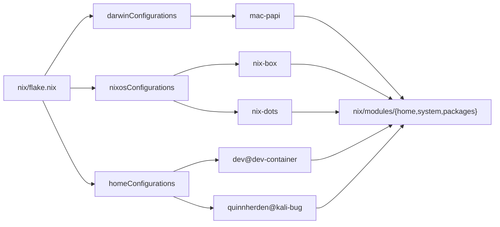

# .dotfiles

[](https://github.com/QuinnHerden/.dotfiles/actions/workflows/ci.yml) [](LICENSE)

Personal Nix dotfiles: home-manager, nix-darwin, and NixOS across my Mac, my NixOS workstations, and a Podman dev container, plus a Claude Code setup (custom agents, skills, and a knowledge base).

> **This is my personal setup, not a template.** Hostnames, hosts, and secrets are mine, and the `knowledge/` submodule is private. Fork and adapt at your own pace; don't expect it to run clean on your machine. It is meant to be *read* for patterns, not cloned wholesale.

## What's in here

| Path | What it is |
|------|------------|
| `nix/flake.nix` | The host matrix. Every machine (darwin / NixOS / home-manager) is an output here. |
| `nix/hosts/` | Per-machine config: `dev-container`, `mac-papi`, `nix-box`, `nix-dots`, `kali-bug`. |
| `nix/modules/` | Shared building blocks (`home`, `system`, `packages`). Package data is centralized in `packages/` and consumed by thin per-platform wrappers. |
| `files/config/` | App dotfiles: nvim, i3, rofi, qutebrowser, karabiner. |
| `files/home/` | Home-level files, including `.claude/` (the Claude Code setup). |
| `files/scripts/` | Bootstrap (`.init`, `.switch`, `.update`) and the `dev` Podman wrapper. |
| `container/` | The dev-container image (Containerfile and entrypoint). |
| `.github/workflows/ci.yml` | CI: flake eval, lint, per-host builds, and a NixOS VM boot test. |



The host matrix: each output kind maps to its host(s), and every host composes the shared `nix/modules` building blocks.

## Start here (reading, not installing)

1. `nix/flake.nix`, the host matrix. See how each machine maps to a set of modules.
2. `nix/hosts/dev-container/`, the smallest and most self-contained host. The best first example.
3. `files/scripts/dev`, the Podman dev-container wrapper.
4. `files/home/.claude/`, the Claude Code setup (below).

## The Claude Code setup

Likely the most reusable part of this repo. `files/home/.claude/` holds:

- **agents/**: focused specialist subagents (system-architect, security-analyst, code-reviewer, data-engineer, cloud-platform, process-analyst, plus GTM, brand, and UX specialists). Each carries compressed named frameworks inline and a `Reference Library` pointer to the deeper source material.
- **skills/**: repeatable procedures (extracting book knowledge into the knowledge base, stress-testing an agent, and more).
- **knowledge/**: a 20/80 extraction library that backs the agents. It lives in the private `private/` submodule (as `private/knowledge`, alongside the NixOS overlay), since the extractions distill copyrighted source material, so it will not populate on a public clone. That is intentional, not a broken repo.

## Install (reinstalling on a new machine)

This is the runbook for setting up a machine, written for me. The host config is keyed by hostname, so the hostname must match an entry before `.switch` will resolve.

### 1. Prerequisites

On macOS, install Nix:

```bash
curl --proto '=https' --tlsv1.2 -sSf -L https://install.determinate.systems/nix | sh -s -- install
```

On NixOS, get online and make git available:

```bash
nmcli d wifi list
nmcli d wifi connect {ssid} --ask
nix-shell -p git
```

On generic Linux (non-NixOS), set the hostname and make sure curl is present:

```bash
sudo hostname {hostname}        # e.g. kali-bug
sudo apt install curl           # or your distro's equivalent
```

### 2. Clone

The repo has private submodules. A plain clone works (the flake falls back to public stubs), but as the owner, init the submodules so the real identifiers load:

```bash
cd ~/
git clone --recurse-submodules https://github.com/QuinnHerden/.dotfiles.git
# or, after a plain clone:
git submodule update --init
```

Without the private overlay (`private/overlay`), the NixOS rebuild scripts warn and fall back to an empty authorized-SSH-keys stub.

### 3. Init

Run the bootstrap script. It is not idempotent in one pass; run it repeatedly until it exits 0.

```bash
sh ~/.dotfiles/files/scripts/.init
```

### 4. Set hostname

The hostname selects which host config to sync to.

```bash
sudo hostname {hostname}        # NixOS / macOS
```

On generic Linux this is already done from step 1. There, `.switch` resolves the `homeConfigurations` entry from `$(whoami)@$(hostname)`.

### 5. Switch

Apply the config:

```bash
sh ~/.dotfiles/files/scripts/.switch
```

## Add a machine

Hosts are data. Each machine is an entry in the `hosts` attrset in `nix/flake.nix`, mapped through `mkHost`. Adding a machine means adding an entry plus its host directory; you never copy a builder block.

Generic starting points live in `nix/hosts/_template/`, one directory per platform (each holds a `default.nix`, so copying the directory needs no rename):

| Directory | For |
|------|-----|
| `nixos/` (`default.nix` + `hardware-configuration.nix`) | A NixOS host |
| `darwin/` | A nix-darwin host |
| `home/` | A standalone home-manager host |

### NixOS host

1. Copy `nix/hosts/_template/nixos/` to `nix/hosts/<name>/`.
2. Replace the stub hardware config with real output:
   ```bash
   nixos-generate-config --show-hardware-config > nix/hosts/<name>/hardware-configuration.nix
   ```
3. In `nix/hosts/<name>/default.nix`, set `hostname.name`, `user.name`, and the package toggles.
4. Add an entry under `hosts.nixos` in `nix/flake.nix`:
   ```nix
   <name> = {
     builder = "nixos";
     hostPath = ./hosts/<name>;
   };
   ```
5. Set the system hostname to `<name>` (see step 4 of the install runbook).
6. Switch:
   ```bash
   sh ~/.dotfiles/files/scripts/.switch
   ```

> **Bootstrap login:** authorized SSH keys come from the owner's private overlay, which a fork does not have, so the template sets a placeholder `initialPassword` (`changeme`) on the primary user to keep a fresh build reachable on first boot. Change it before any real use: add your own SSH key via a private overlay, or replace it with a `hashedPassword` (`mkpasswd -m sha-512`). The owner's real hosts do not set it.

### Darwin host

Copy `nix/hosts/_template/darwin/` to `nix/hosts/<name>/`, set `hostname.name` and `user.name`, then add an entry under `hosts.darwin` with `builder = "darwin"` and `hostPath = ./hosts/<name>`.

### Standalone home-manager host

Copy `nix/hosts/_template/home/` to `nix/hosts/<name>/`, set `home.username` and `home.homeDirectory` in its `default.nix`, then add an entry under `hosts.home` with `builder = "home"`, the right `system` (e.g. `aarch64-linux`), and `hostPath = ./hosts/<name>`.

The username is set in one place per host: `user.name` for NixOS/darwin (the `user` option, which drives the system user, home directory, and home-manager user), and `home.username` for standalone home-manager hosts. Authorized SSH keys come from the private overlay, not the host file.

## Fork this

The public flake evaluates and builds standalone, with no access to anything private. Real identifiers (such as the authorized SSH key) live in a private overlay behind `inputs.private`, which defaults to an in-repo public stub at `nix/private-stub`. CI and forks build against that stub.

To supply your own last mile, pick one:

- Edit the public modules directly.
- Point `inputs.private` at your own overlay.

The owner does the second: a single private submodule at `private/` (holding the overlay and the knowledge library), plus an `--override-input private path:...` baked into the rebuild scripts. The stub default keeps the flake evaluatable, so a fork needs no submodule access.

A fork cannot clone that private submodule (it is owner-only). A plain `git clone` (without `--recurse-submodules`) already leaves `private/` empty and builds clean against the stub; nothing dangles, because the `~/.claude/knowledge` link is created at activation only when `private/knowledge` is actually present. To drop the inherited submodule reference entirely:

```bash
git submodule deinit -f private && git rm -f private && rm -rf .git/modules/private
git commit -m "drop private submodule"
```

The template hosts (`hosts.nixos.template`, `hosts.darwin.template`, `hosts.home.template`) are built in CI to guarantee the public layer stays forkable.

## Dev Containers

Isolated dev environments using Podman. Each container gets the full dotfiles toolchain (zsh, nvim, lazygit, lazydocker, Claude Code) via Nix + home-manager.

### Prerequisites

1. Install [Podman Desktop](https://podman-desktop.io/)
2. Initialize and start the podman machine:
   ```bash
   podman machine init
   podman machine start
   ```
3. Build the dev container image:
   ```bash
   dev --rebuild
   ```

### Usage

```bash
# Create a container with a host directory mounted
dev work ~/repos

# Shell into it
dev --exec work

# Inside the container: repos are at ~/repos
cd ~/repos/motifs
make install && make upd     # compose volume paths resolve correctly

# Manage containers
dev --ls                     # list running dev containers
dev --stop work              # stop and remove
dev --restart work ~/repos   # stop + recreate
dev --rebuild                # rebuild the image (after dotfiles changes)
```

The mounted directory is available at the same host path inside the container, so `docker compose` volume mounts resolve correctly on the VM.

The first start installs Claude Code via npm and takes a few seconds. Subsequent starts are near-instant, since the npm cache persists in a named volume.

### Parallel development

Mount the same directory into multiple containers for parallel branch work:

```bash
dev branch-a ~/repos
dev branch-b ~/repos
# Each container has its own shell, Claude instance, and compose stack
# but shares the same host repos (use separate branches/worktrees)
```


## Post Installation

### MacOS Manual Configurations

- [Configurations](manual-configurations.md)

## License

[MIT](LICENSE). This is a personal setup shared as a readable reference; use anything you find useful, no warranty.
