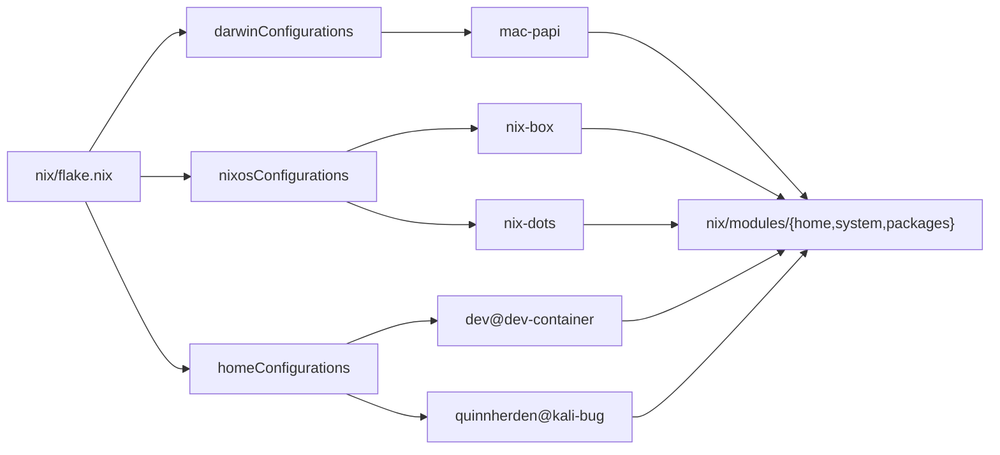

# .dotfiles

[](https://github.com/QuinnHerden/.dotfiles/actions/workflows/ci.yml) [](LICENSE)

Personal Nix dotfiles: home-manager, nix-darwin, and NixOS across my Mac, my NixOS workstations, and a Podman dev container, plus a Claude Code setup (custom agents, skills, and a knowledge base).

> **This is my personal setup, not a template.** The hostnames and host configs are mine, and the private last mile (my SSH key and the knowledge library) lives in a separate private submodule behind `inputs.private`, not in this tree. The public tree carries no secrets: it evaluates and builds against an in-repo stub. Fork and adapt at your own pace; don't expect it to run clean on your machine. It is meant to be *read* for patterns, not cloned wholesale.

## What's in here

| Path | What it is |
|------|------------|
| `nix/flake.nix` | The host matrix. Every machine (darwin / NixOS / home-manager) is an output here. |
| `nix/hosts/` | Per-machine config: `dev-container`, `mac-papi`, `nix-box`, `nix-dots`, `kali-bug`. Plus `_template/` (forkable per-platform starters) and `_shared/` (the workstation profile the NixOS hosts share). |
| `nix/modules/` | Shared building blocks (`home`, `system`, `packages`). Package data is centralized in `packages/`; one generator (`mkPackageModule`) renders it into the per-platform sink (`home.packages`, `environment.systemPackages`, or homebrew). |
| `docs/architecture.md` | How it all fits together: the host matrix, module layering, the package generator, the public/private seam, and CI. Read this to fork deeply. |
| `docs/runbook.md` | Operator how-to: reinstalling, adding a machine, forking. |
| `files/config/` | App dotfiles: nvim, i3, rofi, qutebrowser, karabiner. |
| `files/home/` | Home-level files, including `.claude/` (the Claude Code setup). |
| `files/scripts/` | Bootstrap (`.init`, `.switch`, `.update`) and the `dev` Podman wrapper. |
| `container/` | The dev-container image (Containerfile and entrypoint). |
| `.github/workflows/ci.yml` | CI: flake eval, lint, per-host builds, and a NixOS VM boot test. |



The host matrix: each output kind maps to its host(s), and every host composes the shared `nix/modules` building blocks.

## Start here (reading, not installing)

1. `nix/flake.nix`, the host matrix. See how each machine maps to a set of modules.
2. `nix/hosts/dev-container/`, the smallest and most self-contained host. The best first example.
3. `files/scripts/dev`, the Podman dev-container wrapper.
4. `files/home/.claude/`, the Claude Code setup (below).

For the design behind all of this, read [docs/architecture.md](docs/architecture.md).

## The Claude Code setup

Likely the most reusable part of this repo. `files/home/.claude/` holds:

- **agents/**: focused specialist subagents (system-architect, security-analyst, code-reviewer, data-engineer, cloud-platform, process-analyst, plus GTM, brand, and UX specialists). Each carries compressed named frameworks inline and a `Reference Library` pointer to the deeper source material.
- **skills/**: repeatable procedures (extracting book knowledge into the knowledge base, stress-testing an agent, and more).
- **knowledge/**: a 20/80 extraction library that backs the agents. It lives in the private `private/` submodule (as `private/knowledge`, alongside the NixOS overlay), since the extractions distill copyrighted source material, so it will not populate on a public clone. That is intentional, not a broken repo.

## Dev Containers

Isolated dev boxes using Podman. Each box gets the full dotfiles toolchain (zsh, nvim, lazygit, lazydocker, Claude Code) via Nix + home-manager.

A box is a persistent host dir, `~/containers/<name>`, bind-mounted as `/home/dev`. On first boot the image skeleton is copied in; repos go directly in the box dir. Per-box state (Claude creds, gh/git auth) persists in `.dev-state`, so you authenticate once and it survives stop/restart.

The Podman machine is provisioned to mount only `~/containers`, the Claude knowledge dir, and the Claude memory dir, never your home root. So host secrets (`~/.aws`, `~/.ssh`, `~/.gnupg`, `~/.claude.json`) are unreachable from any container, including ones Claude spawns through the podman socket. See [docs/decisions/0001-secret-blind-dev-vm.md](docs/decisions/0001-secret-blind-dev-vm.md).

### Prerequisites

1. Install [Podman Desktop](https://podman-desktop.io/).
2. Provision the secret-blind machine (once). This creates the machine with the narrow mount set and runs an isolation acceptance test:
   ```bash
   dev --vm-init
   ```
3. Optional: let boxes spawn sibling containers via the podman socket (once):
   ```bash
   dev --sock on
   ```

### Usage

```bash
# Create a box (home = ~/containers/work)
dev work

# Shell into it
dev --exec work

# Inside the box: repos live under repos/
cd ~/work/repos/motifs
make install && make upd     # compose volume paths resolve correctly

# Manage boxes
dev --ls                     # list running boxes
dev --stop work              # stop and remove
dev --restart work           # stop + recreate
dev --rebuild                # rebuild the image (after dotfiles changes)
```

The box home is mounted at the same host path inside the container, so `docker compose` volume mounts resolve correctly on the VM. You can no longer bind an arbitrary host dir outside `~/containers`.

With the socket on, a box can drive the VM's podman daemon to spawn sibling containers, reachable on the host via published ports. The machine is secret-blind, so spawned containers cannot read host secrets. They can read box dirs and the knowledge mount, so never put secrets in a box dir.

The first start installs Claude Code via npm and takes a few seconds. Subsequent starts are near-instant, since the npm cache persists in a named volume.

### Parallel development

Create multiple boxes for parallel branch work. Each has its own home, repos, shell, Claude instance, and compose stack:

```bash
dev branch-a
dev branch-b
# clone the repo into each box's repos/ and work separate branches
```


## Next steps

- **Reinstalling or adding a machine:** [docs/runbook.md](docs/runbook.md).
- **Forking:** [docs/runbook.md#fork-this](docs/runbook.md#fork-this); the design behind the public/private seam is in [docs/architecture.md](docs/architecture.md).
- **Post-install manual steps** (YubiKey, macOS GUI apps): [docs/manual-configurations.md](docs/manual-configurations.md).
- **How it's built and why:** [docs/architecture.md](docs/architecture.md).

## License

[MIT](LICENSE). This is a personal setup shared as a readable reference; use anything you find useful, no warranty.
