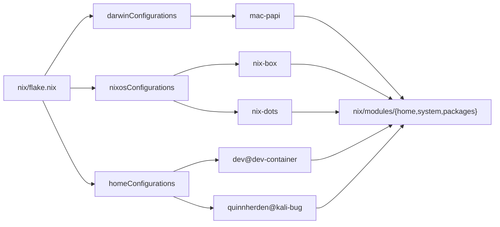

# Architecture

How this repo is built and why. Read this if you are studying it for patterns or forking it deeply. For the install runbook, the add-a-machine steps, and the Claude Code setup, see the [README](../README.md).

## Configuration as data

The thesis is one line: a machine is data, not code. Every host is an entry in the `hosts` attrset in `nix/flake.nix`. A single `mkHost` function folds the right module list around each entry based on its `builder`. You never copy a builder block to add a machine, and you never hand-edit a per-host package list. The same idea repeats at every layer below: packages are data tables rendered by one generator, the username lives in one option, and the private last-mile is one swappable input.

## Flake and the host matrix

`nix/flake.nix` is the whole surface. It holds:

- **inputs.** `nixpkgs` pinned to `nixos-25.05`; `darwin` and `home-manager` follow it. `git-hooks` deliberately does not follow nixpkgs, so the hook tools (nixfmt, deadnix, statix, shellcheck) resolve from its own tested set. `private` is a `flake = false` path input defaulting to `./private-stub` (the public last-mile; see below).
- **`hosts`.** Three groups (`nixos`, `darwin`, `home`), each a map from name to a spec of `{ builder; hostPath; system? }`. The `template` entry in each group is a generic, forkable example.
- **`mkHost spec`.** Branches on `spec.builder` (`nixos` / `darwin` / `home`) and assembles the module list for that platform. This is the only place a builder is invoked.
- **`nixosSystemModules hostPath`.** The shared NixOS module list, used by both `mkHost` and the VM boot test, so the test and the real config cannot drift. It includes `(import inputs.private)`, so the VM test exercises the public/private seam against the stub.
- **outputs.** `nixosConfigurations`, `darwinConfigurations`, and `homeConfigurations` are each `mapAttrs (_: mkHost)` over the matching host group. `devShells` wire the pre-commit hooks. `checks.x86_64-linux.nix-dots-boot` boots `nix-dots` in a QEMU VM and asserts `multi-user.target`, the `quinnherden` user, and `/home/quinnherden` (needs `node.pkgsReadOnly = false` so the node evaluates its own `allowUnfree` nixpkgs).



Each output kind maps to its host(s); every host composes the shared `nix/modules` building blocks.

## Module layering

Modules live under `nix/modules/` in three trees:

- **`system/common`** — fonts, nix settings, the system package sink, and the `user` option. Shared by NixOS and darwin.
- **`system/nixos`** — boot, networking, security, services, users. Several toggles gate on each other: `firewall` and `openssh` trust the `tailscale0` interface only when `services.tailscale.enable` is set, so SSH is reachable over the tailnet but not the public interface.
- **`system/darwin`** — homebrew (`onActivation.cleanup = "uninstall"`, so casks/brews not declared in the data are removed), networking, the primary user.
- **`home`** — the home-manager content, in two delivery modes (below).

Every module is an option with an `enable` flag and a `config = lib.mkIf ...` body. A host turns features on by name; it never inlines configuration. `nix/hosts/_shared/nixos-workstation.nix` is the shared workstation profile (NixOS system + home + service toggles) that `nix-box`, `nix-dots`, and the NixOS template all import; each host then sets only its hostname, hardware config, username, and package overrides.

### Integrated vs standalone home

The home-manager content is the same in both modes; how it is mounted differs.

**Integrated** (NixOS, darwin): home-manager runs inside the system build. `nix/modules/home/integrated` imports three toggle modules, `commonBaseHome`, `linuxBaseHome`, and `darwinBaseHome`. Each, when enabled, mounts its content under `home-manager.users.${config.user.name}`: `commonBaseHome` imports `content/base.nix`, `linuxBaseHome` imports `content/linux.nix`, `darwinBaseHome` imports `content/darwin.nix`. The `name` defaults to `config.user.name`, so the home content lands on the right user automatically.

**Standalone** (`home` builder, e.g. `kali-bug`, `dev-container`): there is no system layer. `nix/modules/home/standalone/default.nix` imports `content/base.nix` directly and maps the package generator at `platform = "home"`. The host file imports `content/linux.nix` itself and sets `home.username` / `home.homeDirectory`.

The asymmetry to notice: standalone hosts pull `content/linux.nix` directly from the host file; integrated hosts pull it via the `linuxBaseHome` toggle. `content/base.nix` is the portable core (the `mkOutOfStoreSymlink` file map, zsh config, `stateVersion = "24.11"`, the knowledge activation script). `content/linux.nix` and `content/darwin.nix` are pure platform deltas layered on top of base; neither imports base itself.

### `user`: one username, one place

`nix/modules/system/common/user.nix` defines `options.user` (`enable`, `name` default `"user"`, `home` a `nullOr str` default `null`, where null derives the platform default home). It has three consumers, all reading the same `config.user.name`:

1. `system/nixos/users/primaryUser.nix` — the NixOS system user.
2. `system/darwin/system/primaryUser.nix` — the nix-darwin system user.
3. the private overlay (`inputs.private`) — attaches the authorized SSH key to that user.

The integrated home toggles also default their target user to `config.user.name`. So an integrated host sets the username once and it flows to the system user, the home directory, the home-manager user, and the SSH key. Standalone hosts have no system user; they set `home.username` directly.

## Packages

Package selection is a data table plus one generator. No per-platform wrapper modules.

- **`categories.nix`** — the single list of categories: `comms dev experimental extra infra ops sec`. Adding a category means adding its data file and this entry.
- **`<category>.nix`** — a data file per category. Each is an attrset of selector functions: `common`, `linux`, `linuxX86`, optionally `heavy` and `linuxGui`, plus a `darwin` attrset of `{ brews; casks; masApps; }`. Only `ops` declares `heavy` and `linuxGui` today.
- **`mkPackageModule.nix`** — `{ category, platform } -> module`. It generates an option named `${category}Packages` and a `config` that writes the selected packages to the platform's sink:
  - `platform = "home"` -> `home.packages`
  - `platform = "nixos"` -> `environment.systemPackages`
  - `platform = "darwin"` -> `environment.systemPackages` (the `common` set) plus `homebrew.{brews,casks,masApps}`

Toggles are driven by the **shape of the data, not the category name**: `hasToggles = (pkg ? heavy || pkg ? linuxGui) && (platform == "home" || platform == "nixos")`. When true, the generator adds `enableGui` and `enableHeavy` options (default `true`) that pull in `linuxGui` / `heavy`. The generator holds no category-specific knowledge, so a new heavy/GUI category gets the toggles for free.

Three tiny aggregators map the generator over every category for their platform: `home/standalone/default.nix` (home), `system/nixos/packages/default.nix` (nixos), `system/darwin/packages/default.nix` (darwin). A host then enables the categories it wants:

```nix
opsPackages.enable = true;
opsPackages.enableGui = false;    # headless / container
opsPackages.enableHeavy = false;
devPackages.enable = true;
```

The home and nixos modules of a category share an option name but write to different sinks. They never coexist (a host is one platform), so the options do not collide.

## Public/private seam

The public flake evaluates and builds with no access to anything private. Real identifiers (the authorized SSH key, the Claude knowledge library) live behind `inputs.private`, which defaults to `nix/private-stub/default.nix` — a no-op (`_: { }`) that sets no keys.

The owner overrides the input. The rebuild scripts pass `--override-input private "path:$HOME/.dotfiles/private/overlay"`; the overlay reads `config.user.name` and attaches the SSH key to that user. The overlay and the knowledge library are one submodule at `private/`.

The seam is **fail-closed**:

- `nix/flake.nix` includes `(import inputs.private)` in `nixosSystemModules`. With no override it imports the stub, which adds nothing.
- `files/scripts/.switch` guards on `$priv/default.nix` existing. If the submodule is absent, it warns and rebuilds against the stub instead of failing.
- CI never checks out `private/`. `nix flake check` and every build run against the stub, which is exactly what a fork gets.

A plain `git clone` (no `--recurse-submodules`) leaves `private/` empty and builds clean. Nothing dangles, because the only link into private content (`~/.claude/knowledge`) is created at activation only when the source is actually present (below).

## Files are live: `mkOutOfStoreSymlink` and the CI gate

Dotfiles under `files/` are not copied into the Nix store and rebuilt on every edit. `content/base.nix`, `content/linux.nix`, and `content/darwin.nix` map them with `config.lib.file.mkOutOfStoreSymlink "${config.home.homeDirectory}/.dotfiles/files/..."`. Home-manager creates a symlink from the target (e.g. `~/.config/nvim`) to the live path in the clone. **Editing the clone takes effect immediately; you do not rebuild to change a config file.** Only adding or removing a managed entry needs a switch.

This is why the CI `changes` filter exists. Builds depend only on `nix/` (the flake source); everything else is referenced via `mkOutOfStoreSymlink` and never read at build time. So a change outside `nix/` (or `ci.yml`) cannot alter a build output, and the filter skips the build matrix and the VM test for those PRs. On push or dispatch (no PR base) it runs everything as a backstop.

One file map is conditional. `~/.claude/knowledge` points at `private/knowledge`, a submodule a fork cannot clone and an out-of-store path pure eval cannot stat. So instead of a `home.file` entry, `content/base.nix` uses a `home.activation.claudeKnowledge` script (`#177`): if the target is a real directory, leave it; elif the source exists, `ln -sfn`; elif the target is a stale link or absent, `rm -f`. It honors `$DRY_RUN_CMD` / `$VERBOSE_ARG`, so `--dry-run` stays read-only. The link therefore exists only when the knowledge library is actually checked out, and never dangles on a fork.

## Dev containers

The dev container (`container/Containerfile`, `container/entrypoint.sh`, launched by `files/scripts/dev`) gives each project an isolated Podman environment with the full toolchain via Nix and home-manager.

The Containerfile is structured for **content-addressed layer caching** (`#125`):

1. Copy only `flake.nix`, `flake.lock`, and `private-stub`, then `nix flake archive`. This layer caches on the lockfile, so unrelated dotfiles changes do not bust the big download.
2. Copy `nix/`, then build and activate the locked `dev@dev-container` home-manager config. Home-manager depends only on `nix/`, so this layer survives a README or agent edit.
3. Copy the rest of the tree (`private/` and `.git` excluded via `.containerignore`). These are runtime symlink targets and do not affect the build above.

Tool versions are pinned (`NIX_VERSION=2.34.7`, `PODMAN_COMPOSE_VERSION=1.6.0`); bump deliberately. `CLAUDE_CONFIG_DIR=/home/dev/.dev-state/claude` relocates the whole Claude config dir to the per-container persistent mount, so credentials and sessions survive recreation.

`entrypoint.sh` re-establishes the Claude wiring on each start: it symlinks the static `.claude/*` sources from the dotfiles clone into the config dir (so editing the clone is live), links the shared global memory, links the read-only knowledge mount into both `~/.claude/knowledge` and the config dir (`#181`), persists `gh` auth, and installs `@anthropic-ai/claude-code@latest --include=optional` (intentionally unpinned, unlike the Nix toolchain).

The `dev` launcher mounts the host directory at the same path inside the container (so compose volume paths resolve), uses `--userns=keep-id`, gives each container its own `.dev-state`, and mounts the knowledge library only if the submodule is present. The container runtime socket is host-root-equivalent, so it is opt-in (`--sock on` or `DEV_DOCKER_SOCK=1`) and prints a security warning. The `dev-container` host is a standalone home config for user `dev` with `opsPackages.enableGui = false` and `enableHeavy = false`, and ships an `hm-switch` script to re-apply the home config in a running container without an image rebuild.

## CI and gating

`.github/workflows/ci.yml`:

- **changes** — sets `build=true` only when the PR diff touches `nix/` or `ci.yml`; otherwise the builds and VM test skip (rationale above). Always `true` on push/dispatch.
- **flake-check** — `nix flake check --no-build --all-systems ./nix`. Evaluates every output for every system on one x86_64 runner. `private/` not checked out.
- **lint** — `pre-commit run --all-files` via `nix develop`, the exact same hook pipeline as a local commit (one source of truth in `flake.nix`).
- **placeholder-guard** — greps for `changeme` outside `nix/hosts/_template/` and fails if found. Content-only, so it always runs (not gated on `changes`).
- **build** — a matrix: `nix-dots`, `nix-box`, `dev@dev-container`, `quinnherden@kali-bug`, `mac-papi`, plus the `template nixos` and `template home` hosts. The darwin template is eval-only (covered by `flake-check` and `mac-papi`). Gated on `changes`.
- **nixos-vm-test** — boots `nix-dots` in a QEMU VM on a KVM runner (~11.5 min). The slow job; same `changes` gate.
- **ci-required** — `if: always()`, `needs` all jobs, passes when every job is green or skipped. This is the single required status check, so `build` and `nixos-vm-test` can stay conditional while remaining enforceable. `main` is PR-protected; `dev` is the integration branch.

## Forkability

The public layer is built to fork without owner access:

- **Templates.** `nix/hosts/_template/{nixos,darwin,home}/` are copy-the-directory starting points (each holds a `default.nix`, so no rename on copy). The `template` host in each flake group is built in CI to guarantee the public layer stays evaluatable and buildable without the private overlay.
- **Bootstrap login.** Authorized SSH keys come from the private overlay, which a fork lacks. So the NixOS template sets `initialPassword = "changeme"` on the primary user (`#176`), which applies only at first user creation, to keep a fresh build reachable on first boot. The `placeholder-guard` job prevents that placeholder from leaking into a real host config. The owner's real hosts do not set it.
- **Self-healing knowledge link.** The conditional `claudeKnowledge` activation script (`#177`, above) means a fork never gets a dangling `~/.claude/knowledge`.
- **Residual owner values.** A few things still carry the owner's identity: the CI build matrix (`OWNER HOSTS` vs `KEEP THESE`), the iTerm2 profile name in `files/home/iterm2/profile.json`, and per-host `time.timeZone`. The README's "Residual owner-specific values" section lists what to change.

To supply your own last mile, either edit the public modules directly or point `inputs.private` at your own overlay. The stub default keeps the flake evaluatable either way, so a fork needs no submodule access.
