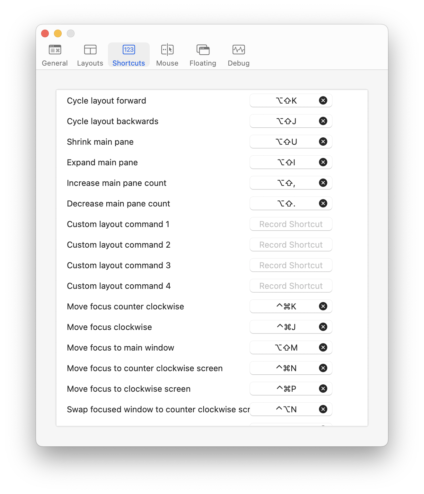
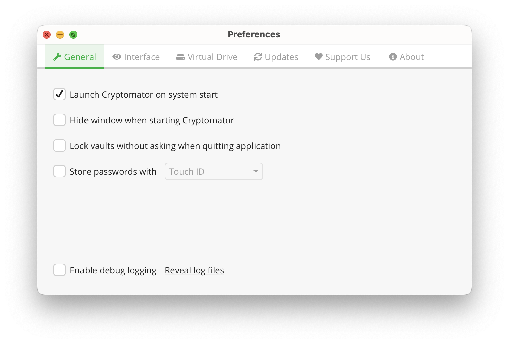
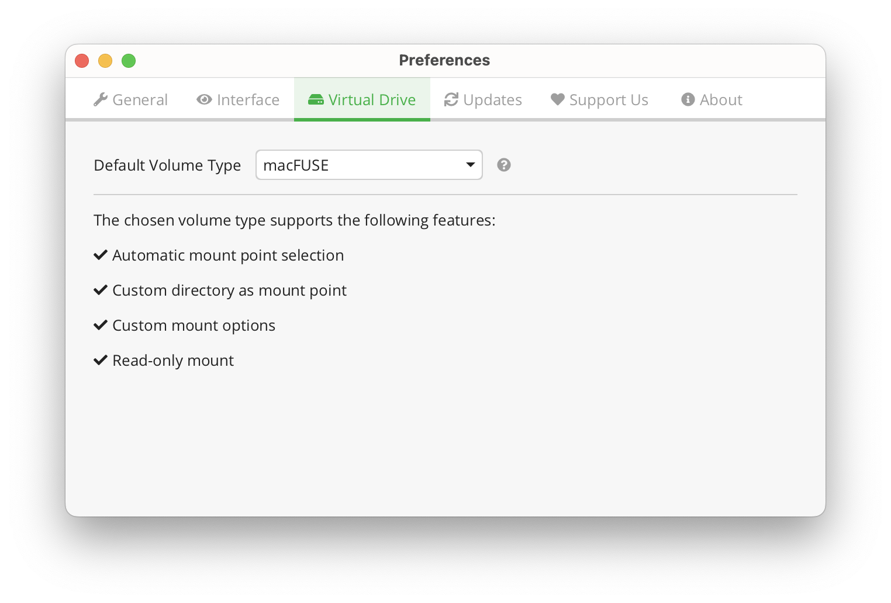
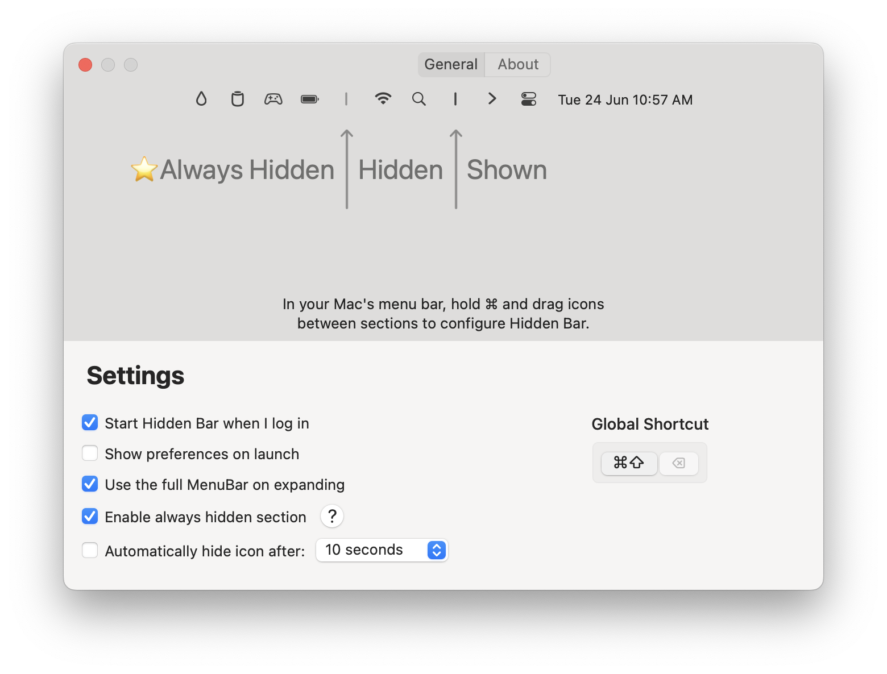
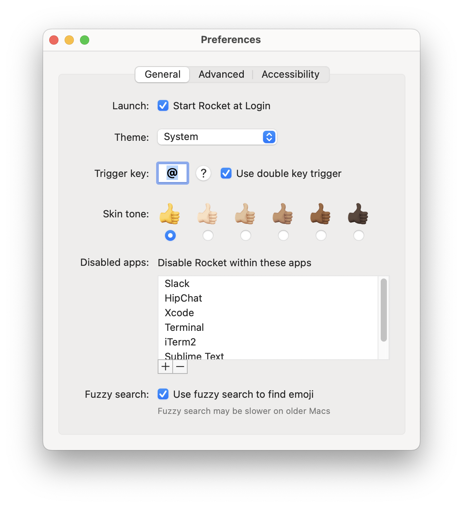
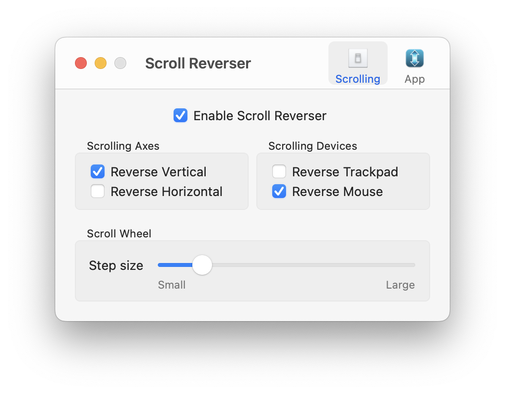

# Manual Configurations

## Darwin

### General

#### Amethyst

#### Cryptomator

#### Hidden Bar

#### Rocket

#### Scroll Reverser

### System

#### Sound Control

1. Boot into Recovery Mode
2. Select Options
3. Open Terminal from the Utilities menu
4. Run `spctl kext-consent add LDG5AR2ES5`
5. Run `reboot`

#### YubiKey

- Set up PIV
- Change user's password
