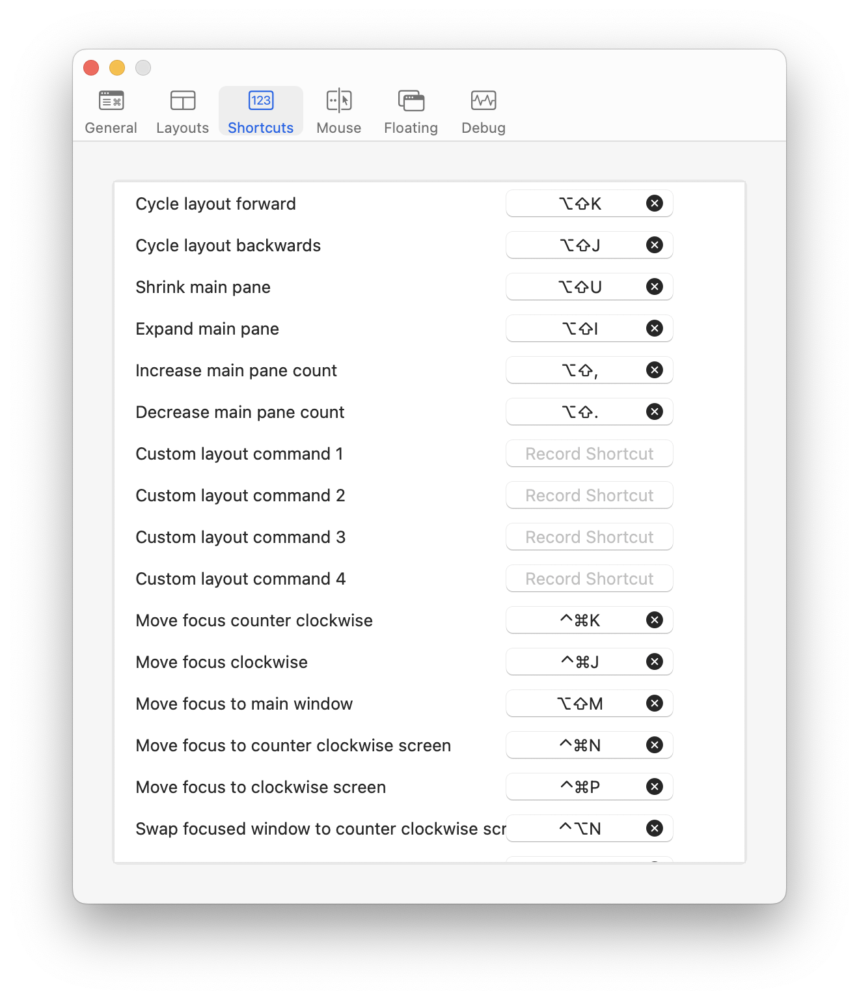
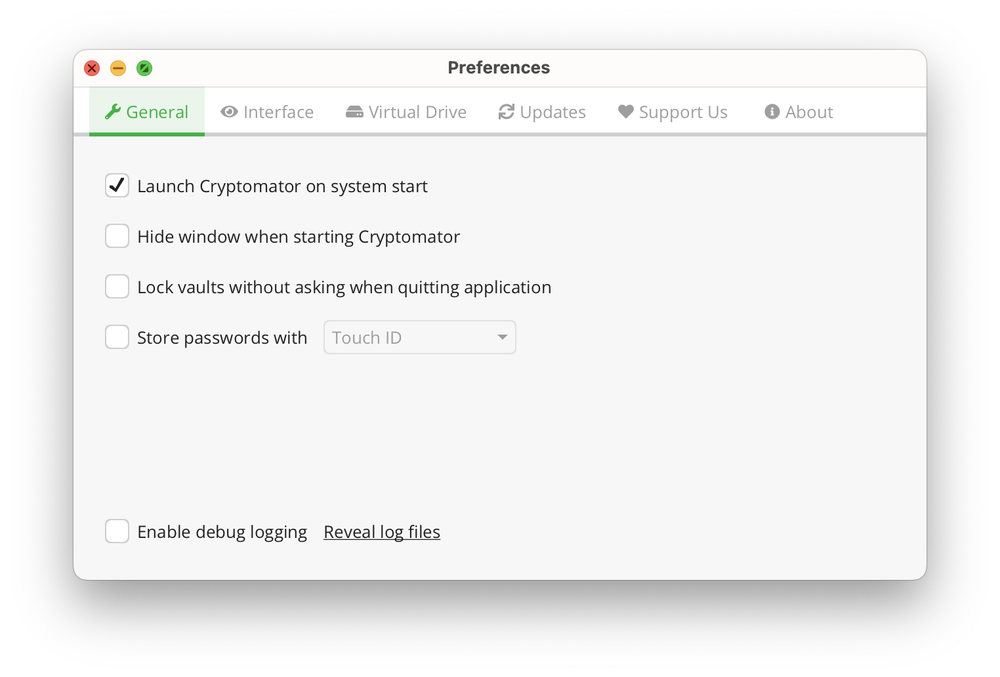
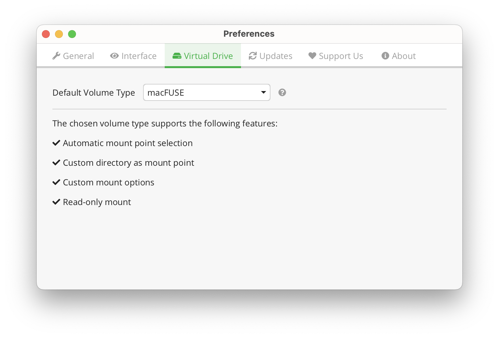
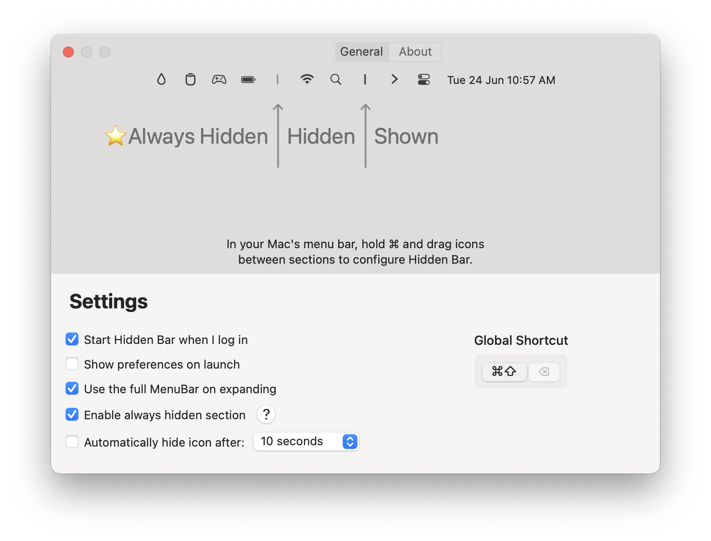
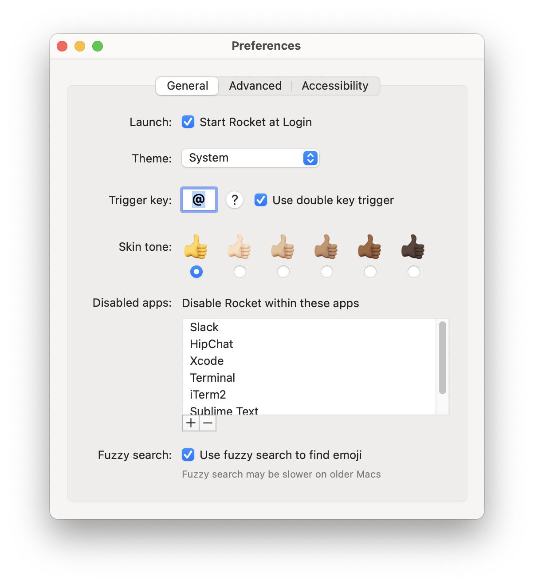
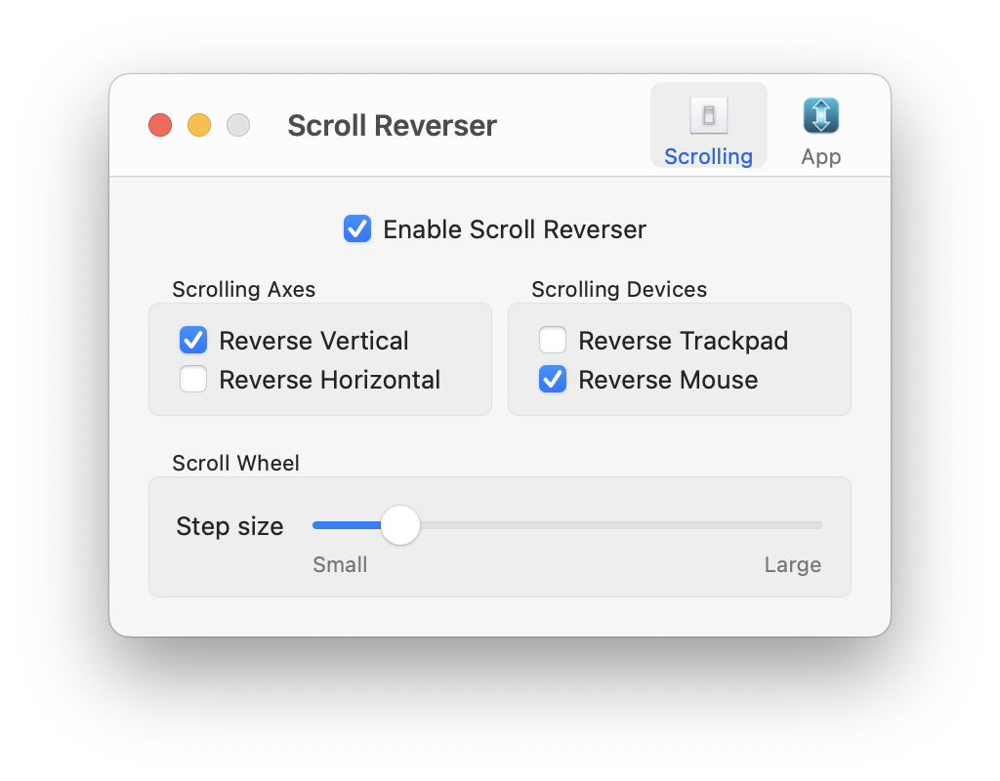

# Manual Configurations

## NixOS

### System

#### YubiKey

##### Add Pin to YubiKey(s)

- `nix-shell -p yubikey-manager`
- `ykman fido access change-pin`

##### Add YubiKey(s) to Current User

first key:

- `nix-shell -p pam_u2f`
- `mkdir -p ~/.config/Yubico`
- `pamu2fcfg > ~/.config/Yubico/u2f_keys`

for additional keys:

- `pamu2fcfg -n >> ~/.config/Yubico/u2f_keys`

##### Test authentication

- `nix-shell -p pamtester`
- `pamtester login {username} authenticate`

## Darwin

### General

#### Amethyst

#### Cryptomator

#### Hidden Bar

#### Rocket

#### Scroll Reverser

### System

#### Sound Control

1. Boot into Recovery Mode
2. Select Options
3. Open Terminal from the Utilities menu
4. Run `spctl kext-consent add LDG5AR2ES5`
5. Run `reboot`

#### YubiKey

- Set up PIV
- Change user's password
